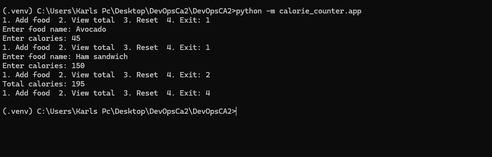
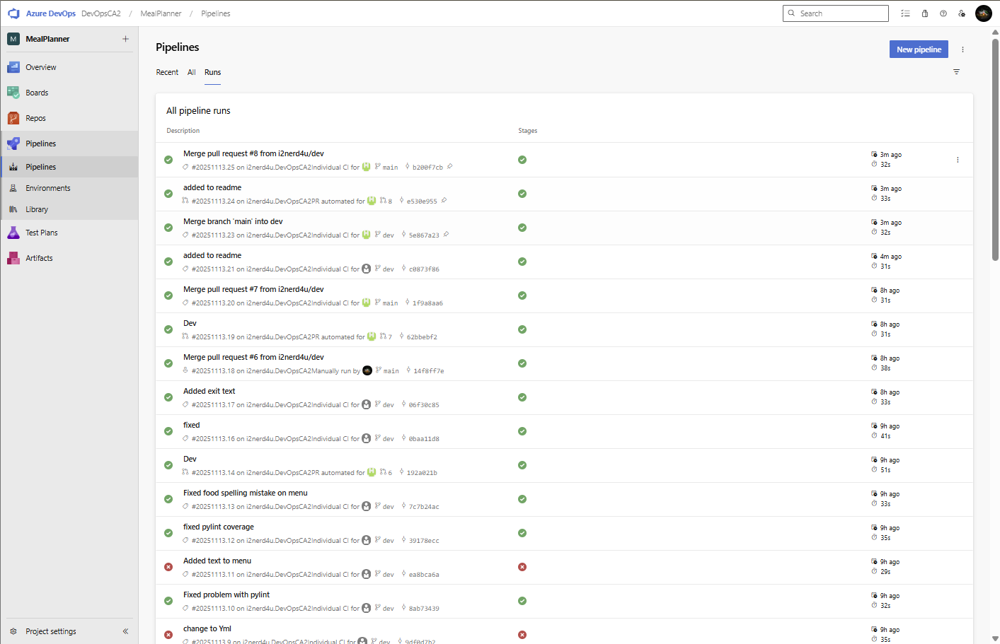
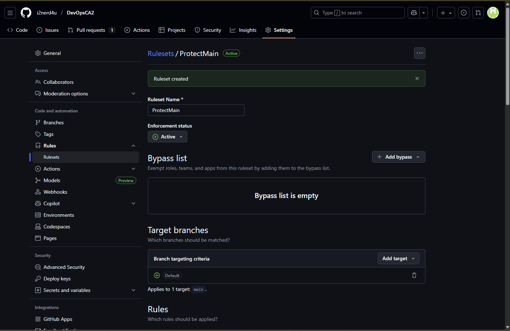
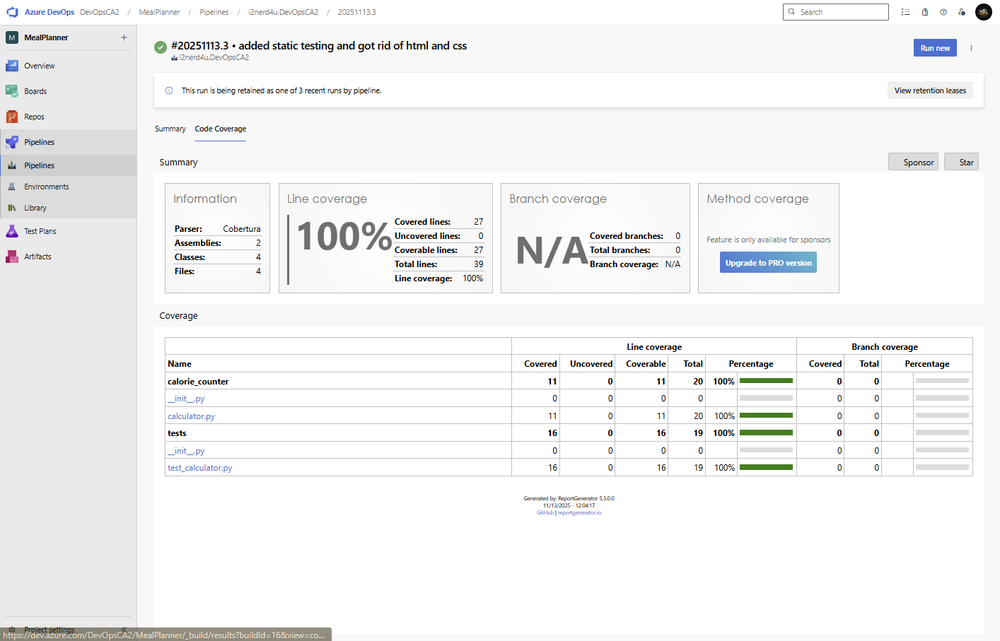

# Project Name = Calorie Tracker

## Overview = 
Calorie Tracker is a command line Python application that will allow user to input meals/food they have consumed and enter in the calories that the food contained and it will count calories on a daily basis. The program can has 4 options: \n 1- Add food, 2- Total, 3- Clear and 4- exit. The focus of this project is to demonstrate the use of Continuous Integrations practices, with automated testing, pipeline and static code analysis.

## Technologies Used - 
Python, HTML, CSS, Github, Azure Pipelines, pytest, pylint 

## Local Development Setup
Clone the local Directory:
1- git clone https://github.com/YourUsername/X00189280_CA2.git
2- cd DevOpsCA2

Create a virutal Environment:
1- python -m venv .venv
2- source .venv/bin/activate

Install the required packages:
1- pip install -r requirements.txt

Run the Application:
1- python -m calorie_counter.app

## Application Features: 
Add Meal:
Input the name of the Meal/food and its calories

View Total Calories:
Display the total calories consumed for the day

Reset Day:
Clear all entered meals and reset the calorie count for the day

Exit:
Exit the application

## CI Pipeline Implementation
The azure pipeline is configured using the azure-pipeline.yml file
The pipeline includes:
- Install dependencies allows for all of the needed resources to be aquired automatically.
- Automatically running unit tests with pytest
- Automatically generates code coverage reports (XML and console) which enforces a minimum of 95% coverage
- Runs static code analysis using Pylint
- Publishes coverage results to Azure Dev Ops pipeline.

## Branch Policies and Protection
Branches:
- main
- dev
Branch Protection Rules:
- No deletion allowed (main branch cannot be deleted)
- No non-fast-forward updates: All changes must be merged cleanly (no forced pushes)
- Require pull request reviews before merging
        - Atleast 1 approving review before merging
        - Merge Methods allowed: Merge, Squash, Rebase
- Required Status checks:
        - The pipeline is defined in azure-pipelines.yml must pass before merging
        - Strict enforcement that PR cannot merge unless status checks pass.
- Enforced code review and meaningful commit messages

## Testing Strategy
Unit testing:
 - Adding meals
 - Calculated total calories for the day
 - resetting the day
 Test Coverage:
 - minimum 95% code coverage enforced via Azure Pipelines
 - coverage is measured using coverage.py and generated both console reports and XML reports for publishing
Static analysis:
- Pylint is being usied to check the code quality
- Azure pipeline runs pylint as part of the CI process
Pipeline Integration:
- Unit tests and static analysis are automatically triggered on dev and main branches.
- PR's cannot be merged unless the pipeline passes all of the tests and status checks

## Troubleshooting Guide
Pylint not recognized:
- Ensure that pylint is installed in your virtual environment: pip install pylint

ModuleNotFoundError(eg. No module named 'calculator')
- Ensure you are running the CLI from the root directory of the project (DevOpsCA2)
- run the CLI : 
    python -m calorie_counter.app

If Pipeline Fails:
- Please ensure that the python version in Azure matches your local version (Python 3.12)
- Check the pipeline logs for specific error messages and address them accordingly
- Ensure to install requirements.txt to ensure all dependencies are met. 